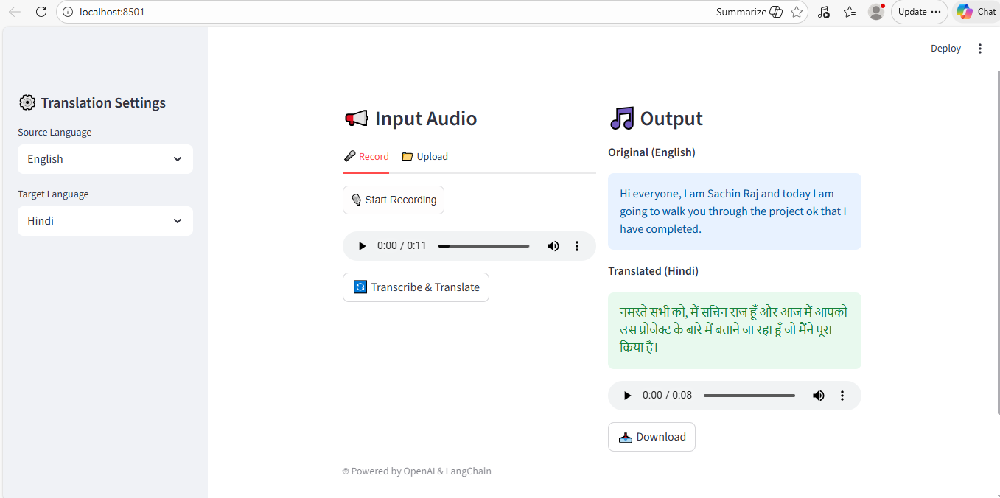

# 🎙️ Indian Language Speech Translator (Voice → Voice)

A **Streamlit-based multilingual speech translation application** that enables users to record or upload audio, transcribe it using **OpenAI Whisper**, translate it into any Indian scheduled language using **GPT**, and generate spoken audio output using **OpenAI Text-to-Speech**.

This project focuses on **Indian language accessibility**, supporting **22+ Indian languages** including Hindi, Maithili, Marathi, Tamil, Telugu, Bengali, and more.

---

## 🚀 Features

- 🎤 Live voice recording using microphone  
- 📁 Audio file upload (WAV / MP3)  
- 🧠 Speech-to-text transcription using OpenAI Whisper  
- 🌍 Multilingual translation between Indian languages  
- 🗣️ Text-to-speech generation for translated output  
- 📥 Download translated audio  
- 🧾 Native script support for target languages  
- ⚡ Simple and clean Streamlit UI  

---

## 🧩 Architecture Overview

Audio Input (Mic / File)
↓
Whisper (Speech → Text)
↓
GPT Translation (Text → Target Language)
↓
OpenAI TTS (Text → Speech)
↓
Audio Playback & Download


---

## 🛠️ Tech Stack

- **Frontend**: Streamlit  
- **Speech-to-Text**: OpenAI Whisper (`whisper-1`)  
- **Translation**: OpenAI GPT (`gpt-4o-mini`)  
- **Text-to-Speech**: OpenAI TTS (`tts-1`)  
- **Frameworks**: LangChain  
- **Language**: Python  
- **Audio Recorder**: streamlit-mic-recorder  

---

## 🌐 Supported Languages (22+)

Hindi, Bengali, Marathi, Telugu, Tamil, Gujarati, Urdu, Kannada, Odia, Malayalam, Punjabi, Assamese, Maithili, Santali, Kashmiri, Nepali, Konkani, Sindhi, Dogri, Manipuri, Bodo, Sanskrit, English

> ⚠️ **Note:** TTS support for smaller dialects (e.g., Santali, Bodo) may be limited.

---

## 📦 Installation

### 1️⃣ Clone the Repository
```bash
git clone https://github.com/sachin992/your-repo-name.git
cd your-repo-name

2️⃣ Create Virtual Environment (Optional)
python -m venv venv
source venv/bin/activate   # Linux / macOS
venv\Scripts\activate      # Windows

3️⃣ Install Dependencies
pip install -r requirements.txt

🔑 Environment Setup

Create a .env file in the root directory:

OPENAI_API_KEY=your_openai_api_key_here

▶️ Run the Application
streamlit run app.py


Open in browser:

http://localhost:8501

🧪 How to Use

Select source and target languages from the sidebar

Record audio OR upload an audio file

Click “Transcribe & Translate”

View:

Original transcript

Translated text

Listen to translated speech

Download the generated audio
